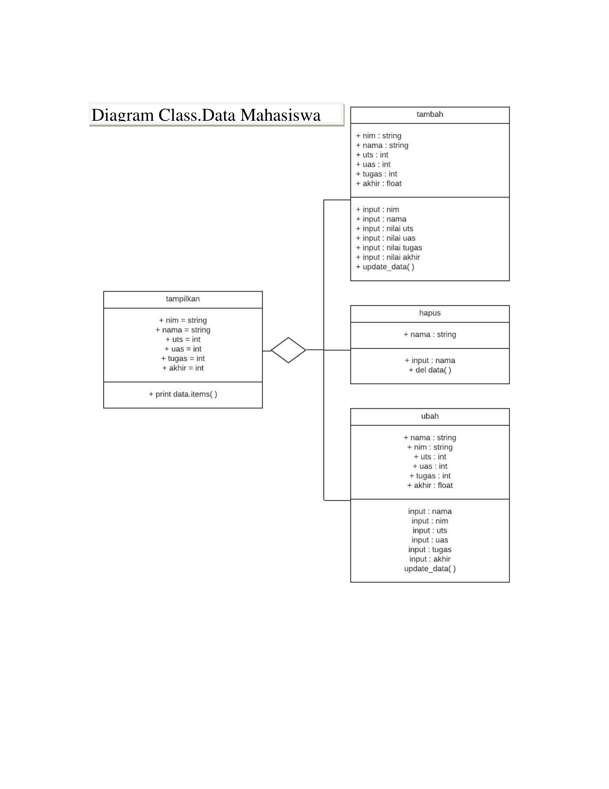
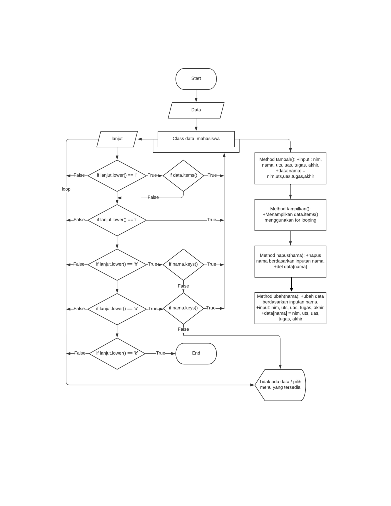

# pratikum8

# OOP (Object-Oriented Programming)
# Pertemuan-11

## Profil
| Variable | Isi |
| -------- | --- |
| **Nama** | Raditra Ikhwanul Arifin |
| **NIM** | 312310487 |
| **Kelas** | TI.23.A5 |
| **Mata Kuliah** | Bahasa Pemrograman |

$${\color{lightblue}PYTHON}$$

## Program Class Data_Mahasiswa
* **Diagram Class**


* **Flowchart**


### **Penjelasan dan kode Programnya**   
Program kita kali ini akan menggunakan sistem OOP(Object-Oriented Programming), apa itu OOP?
OOP(Object-Oriented Programming) merupakan sebuah cara untuk membangun sebuah aplikasi dengan memandang sebagai presentasi objek-objek yang saling mendukung serta berinteraksi dari satu objek ke objek yang lainnya, dan dapat dikatakan code program akan terbentuk berkelompok berdasarkan objek. 
Fungsi secara singkat yakni meringkas sebuah program yang berulang-ulang dengan menggunakan syntaks def nama_fungsi(argument). def diartikan sebagai definisi.
1. Kita akan mendeklarasikan atau menginput sebuah variabel bertipe data dictionary kosong `data={}` yang nantinya akan kita inputkan sebuah data yang terdiri dari: nama, nim, nilai_tugas, nilai_uts, nilai_uas dan nilai_akhir.
2. kita membuat class ``data_mahasiswa()``
3. Membuat fungsi
    * Fungsi tambah(), untuk menambahkan data `def tambah()`
    * Fungsi tampilkan(), untuk menampilkan data `def tampilkan()`
    * Fungsi hapus(nama), untuk menghapus nama pada data `def hapus(nama)`
    * Fungsi ubah(nama), untuk mengubah nama pada data `def ubah(nama)`
    * Fungsi salah(), untuk inputan yang tidak sesuai perintah `def salah()`
4. Menggunakan Perulangan while (while loop)
`while True:`, dapat diartikan perulangan akan terus mengulang jika inputan benar dan masuk kedalam proses jika tidak maka perulangan berhenti atau lanjut ke proses selanjutnya. 
variabel *lanjut* kita gunakan untuk menginput perintah yang akan kita proses `lanjut=input(str('(L)ihat, (T)ambah, (U)bah, (H)apus, (K)eluar))`, disini kita menggunakan statement if untuk memproses perintah yang di inginkan sesuai inputan pada variabel *lanjut*:
    * `if lanjut.lower() == 'l':`

        `if data.items():`

        `tampilkan()`

        `else:`

        `salah()`

    * `if lanjut.lower() == 't':`

        `tambah()`

    * `if lanjut.lower() == 'h':`

        `nama = input(str('Nama\t: '))`

        `if nama in data.items():`

        `hapus(nama)`

        `else:`

        `salah()`

    * `if lanjut.lower == 'u':`

        `nama = input(str('Nama\t: '))`

        `if nama in data.items():`

        `ubah(nama)`

        `else:`

        `salah()`
* **Kode Program**  
```python 
class mahasiswa():
    def __init__(self):
        self.nama = []
        self.nim = []
        self.uts = []
        self.uas = []
        self.tugas = []


    # Menambahkan data inputan 
    def tambah(self):
        print("Tambah data\n")
        nama    = input("Nama           : ")
        self.nama.append(nama)
        nim     = int(input("NIM            : "))
        self.nim.append(nim)
        uts     = int(input("Nilai UTS      : "))
        self.uts.append(uts)
        uas     = int(input("Nilai UAS      : "))
        self.uas.append(uas)
        tugas   = int(input("Nilai Tugas    : "))
        self.tugas.append(tugas)


    # Menampilkan seluruh data 
    def lihat(self):
        for i in range(len(self.nama)):
            print(f"\nData ke -{i+1}")
            print(f"Nama Mahasiswa: {self.nama[i]}")
            print(f"NIM Mahasiswa : {self.nim[i]}")
            print(f"Nilai UTS     : {self.uts[i]}")
            print(f"Nilai UAS     : {self.uas[i]}")
            print(f"Nilai TUGAS   : {self.tugas[i]}")
                
        # Menghapus inputan nama
    def hapus(self, nama):
        print("Hapus data inputan")
        nama = (input("\nMasukan Nama berdasarkan inputan : "))
        if nama in self.nama:
            print("Data {0} berhasil di hapus".format(nama))
            index = self.nama.index(nama)
            del self.nama[index]
            del self.nim[index]
            del self.uts[index]
            del self.uas[index]
            del self.tugas[index]
        else:
            print("NAMA {0} TIDAK ADA!".format(nama))
    
        # Mengubah data nama inputan
    def ubah(self, nama):
        nama = input("Nama yang ingin di ubah : ")
        if nama in self.nama:
            index = self.nama.index(nama)
            self.nim[index]     = int(input("NIM            : "))
            self.uts[index]     = int(input("Nilai UTS      : "))
            self.uas[index]     = int(input("Nilai UAS      : "))
            self.tugas[index]   = int(input("Nilai Tugas    : "))

            print("\nData {0} berhasil di ubah".format(nama))
        else:
            print("NAMA {0} TIDAK ADA!".format(nama))


print("="*20)
print("|PROGRAM INPUT DATA|")
print("="*20)

data = mahasiswa()

while True: 
    print()
    menu = input("[(T)ambah, (L)ihat, (H)apus, (U)bah, (K)eluar] : ")
    print("~"*78)
    print()

    if menu.lower() == 't':
        data.tambah()

    elif menu.lower() == 'l':
        if data.nama:
            data.lihat()
        else:
            print("BELUM ADA DATA!, pilih [T/t] untuk menambah data")       

    elif menu.lower() == "h":
        data.hapus(data.nama)


    elif menu.lower() == "u":
        data.ubah(data.nama) 

    elif menu.lower() == "k":
        print("Program selesai, Terima Kasih :) ")
        break

    else:
        print("\n INPUT {} TIDAK ADA!, Silakan pilih [T/L/H/U/K] untuk menjalankan program!".format(menu))
```
* **Output**
 

## Penjelasan

#### 1. Class DaftarNilaiMahasiswa:

- `__init__(self)`: Method ini merupakan konstruktor class yang digunakan untuk inisialisasi objek saat dibuat. Dalam hal ini, objek `DaftarNilaiMahasiswa` memiliki atribut daftar_nilai yang diinisialisasi sebagai sebuah list kosong.

- `tambah(self, nama, nilai)`: Method ini digunakan untuk menambahkan data mahasiswa ke dalam daftar nilai. Setiap data mahasiswa disimpan dalam bentuk dictionary dengan kunci 'nama' dan 'nilai', lalu ditambahkan ke dalam list `daftar_nilai`.

- `tampilkan(self)`: Method ini digunakan untuk menampilkan seluruh daftar nilai mahasiswa. Menggunakan loop, setiap elemen di dalam `daftar_nilai` diprint dengan format tertentu.

- `hapus(self, nama)`: Method ini digunakan untuk menghapus data mahasiswa berdasarkan nama. Method ini melakukan pencarian nama di dalam daftar_nilai dan menghapus data jika ditemukan.

- `ubah(self, nama, nilai_baru)`: Method ini digunakan untuk mengubah nilai mahasiswa berdasarkan nama. Method ini mencari nama di dalam daftar_nilai dan mengubah nilai jika ditemukan.

#### 2. Contoh Penggunaan Program:

- Membuat objek `daftar_nilai_mahasiswa` dari class `DaftarNilaiMahasiswa`.

- Memanggil beberapa method pada objek tersebut untuk menambahkan, menampilkan, menghapus, dan mengubah data mahasiswa.

- Contoh penggunaan termasuk menambahkan tiga mahasiswa, menampilkan daftar nilai, menghapus mahasiswa dengan nama "Ridho", mengubah nilai mahasiswa dengan nama "Ardho", dan kembali menampilkan daftar nilai.

#### 3. Catatan Penting:

- Program ini bersifat sederhana dan hanya bertujuan sebagai contoh. Dalam aplikasi nyata, mungkin perlu ditambahkan fitur keamanan, validasi input, dan penanganan kesalahan lebih lanjut.

- Penggunaan class memungkinkan untuk mengorganisasi dan mengelola data dengan lebih terstruktur, memisahkan logika program ke dalam bagian-bagian yang terpisah (method), dan memfasilitasi pemeliharaan dan pengembangan lebih lanjut.# praktikum8